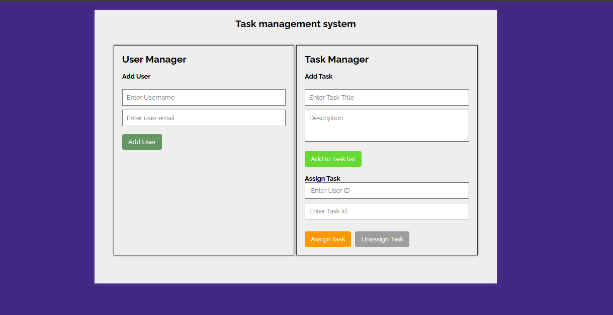
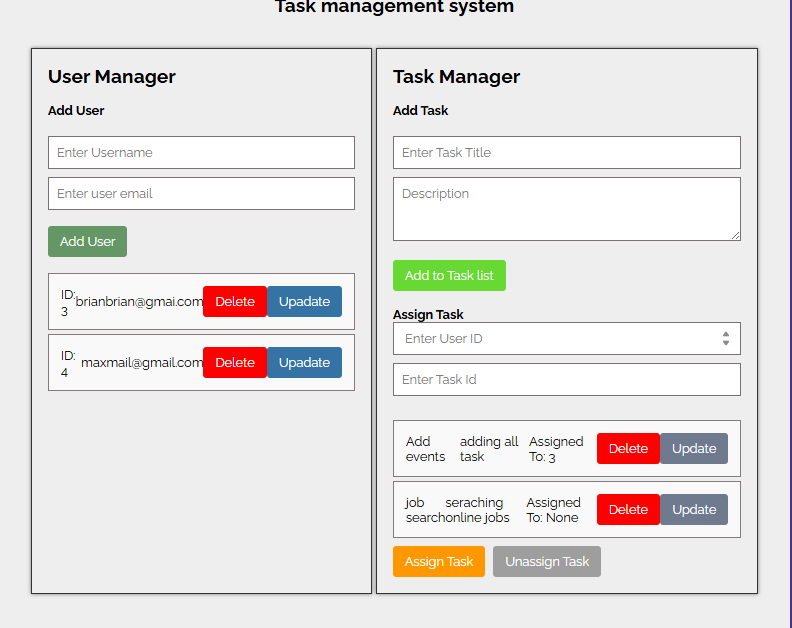

# User and Task Management System

### Screenshot




A TypeScript implementation for managing users and tasks with assignment capabilities.

## Core Features

### User Service
- Create, read, update, and delete users
- Find users by ID or age
- Maintains user database

### Task Service
- Create, read, update, and delete tasks
- Assign/unassign tasks to users
- Get tasks assigned to specific users

## Quick Start

```typescript
const userService = new UserService();
const taskService = new TaskService(userService);


const user1 = userService.createUser("Alice", 25);


const task1 = taskService.createTask("Learn TypeScript");


taskService.assignTask(task1.id, user1.id);

const userTasks = taskService.getTasksByUser(user1.id